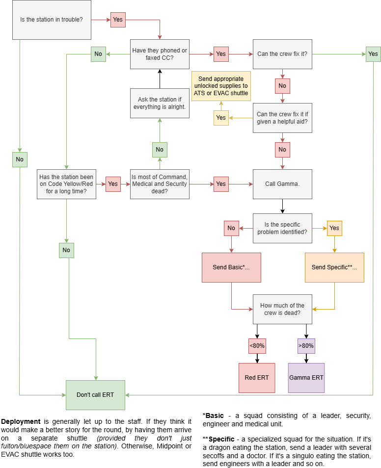
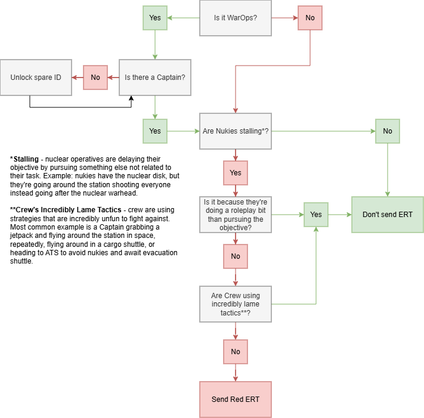

# ERT
> *Emergency Response Teams are specialized elite units of NanoTrasen. Trained to handle any emergency, they're a fearsome enemy to anyone who opposes the company.*
> 
> Unfortunately, all the good ones are too busy saving company stocks. The lackeys are going to have to pull their weight. 
 
ERT are staff spawnable ghost roles for players to play.
They're usually used to help out the crew whenever their odds are incredibly against them. Though, eventers also tend to use them for CC inspections or other events.

There are several levels of ERT:

- **Amber**
  - They're more designed for regular station activities, non-emergency. They come with an APC and basic handguns + disablers.
- **Red**
  - Designed to respond to emergencies. They come with their own hardsuits and specialized gear. Should be generally the standard for deployment.
- **Gamma**
  - Designed to respond to extreme emergencies. Come with even stronger gear. They are, however, should generally be limited to deploy under extreme circumstances *(there are barely any crew left or the odds of survival for ERT are abysmal.)*

There are also several specializations of ERT:

- **Leader**
  - They are, as the name implies, the leader of their squadron. Their job is to manage their squad, manage the crew and follow Central Command's orders. They're also allowed to be picked by eventers themselves, if there are no available ghost to possess them.
- **Security**
  - Combat units. Their purpose is to be the ones killing the threat, or delaying them long enough for the primary mission to succeed. They're equipped with the heaviest armaments, with player chosen loadouts.
- **Engineer**
  - Engineering units. Equipped with a special RCD, they're designated to repair the station or ensure evacuation is properly sealed and repaired for efficient repairs. However, equipped with lesser firearms, they're not great at dealing with threats head on. Send them to fix stations.
- **Medical**
  - Provide healthcare to their teams or crew. Equipped with medical equipment, which gets stronger depending on their level, they're designated to either heal the wounded on evac/midpoint, or be medics to their team. If they don't die first, they're an invaluable unit to their team, due to them having incredible strong meds to instantly patch up any wound.
- **Chaplain**
  - Dispel any glimmer or cultist activity. While they're not well-equipped for combat, they are, however, ready to de-convert any possessions or deal with any ghostly haunting. Don't send them to deal with Colossus though.
- **Janitor**
  - The strongest unit of the team. Equipped with only The Mop and a grenade launcher loaded with cleannades. Any filth, living or dead, fear their name. They do not need any fancy guns, only the mop is a viable weapon. Due to that, Central Command holds them in their highest regard.
- **CBURN**
  - Biological contamination units. They're mainly designed to fight with zombies, due to them coming with free cures and equipped with incendiary rounds. Send them whenever zombies overrun the station or have to deal with diseases.
- **SRT**
  - Special Response Team, designed for riot control or threat extermination. Usually spawned in during Epsilon or a major antag takeover attempt of MidPoint. **Do not deploy them without Senior Curator permission.**

Try deploying them in a group, specialized to combat the specific emergency. 
If it's some sort of medical emergency, spawn a couple of medical units, alongside a security and a leader to ensure no further casualties occur. 
If it's an engineering problem, spawn a couple of engineers, alongside a doctor to treat the wounded if needed.

While their gear is usually good enough to combat the problem, sometimes giving additional tools or supplies might be helpful.
For emergencies like singuloose, it's better to spawn in de-accelerators for engineers, since they don't come equipped to combat this specific scenario.
**However, avoid over-gearing them as well.** This usually applies to ERT security, by giving them extra medicine or weapons. In most cases, they don't really need it.

## Emergency Call
If the station is in trouble, eventers can send ERT to help out the crew. Though we have strict conditions WHEN to spawn them, due to their effect on antagonists.
Luckily, we have a chart to simplify our system:

### Regular ERT Chart:

### WarOps ERT Chart:

The premise is that you're trying to strike a balance between crew and antagonists. If there are nukies, and they wiped the crew under 1 minute, it might be fine to send in ERT to prevent a super easy and cheesy win. But if they fought like hell through the crew, it might not be wise to rob them from their victory.

In most cases, someone will complain about your decision of sending ERT, but don't let that discourage you! Some general questions you can ask yourself to decide if it is worth sending them in:
- Will this add anything to the round?
  - If you think that deploying your units to the station might add to the overall story of the round, do it.
- Would this pose as an unfair battle to the major antagonist?
  - If, say, a dragon swooped in, and you got a fax about their attack, view how much damage the dragon is causing. If they managed to overrun the station with their carp flood, give them a hand at evacuation with security units. If you can think that security and crew can manage it on their own, maybe don't send it, or give send them some supplies.

Trust your judgement. If you can't, ask other staff for help.

### Sending Them In

You have two choices in how you can send them in.
- The Evacuation Shuttle
  - A classic choice and simple. If the crew called in evacuation, you can spawn in the incoming shuttle and have them prepare (or call in an earlier evacuation yourself, but refrain from this). However, the con of this, is that usually, ERT has a minimal impact on the situation. They either become door guards or extra doctors to help out with the wounded.
- The Separate Shuttle
  - You can either spawn in a shuttle using commands or using the CC shipyard console to grab yourself a shuttle. This method allows you for a non-evacuation shuttle deployment and possibly send in your guys much earlier than expected. *However*, if you're trying to time it with an evacuation shuttle, chances are, they will deploy around the time evacuation leaves. This is mainly due to the time it takes for ghost players to take the role, figure out their loadouts and deploy on the station.

## Non-Emergency Call
In the case you need an ERT member for some event, spawning them in is also fine. They're most commonly used to be bodyguards for important CC members, but other various uses can be found for them, like sending them in for a special package recovery mission.

Take into consideration what threat level or what type of scenario you're taking them in. You don't want Gamma units walking around for a simple protection job of an inspector. That would be waste of money and make antagonists lives much harder.