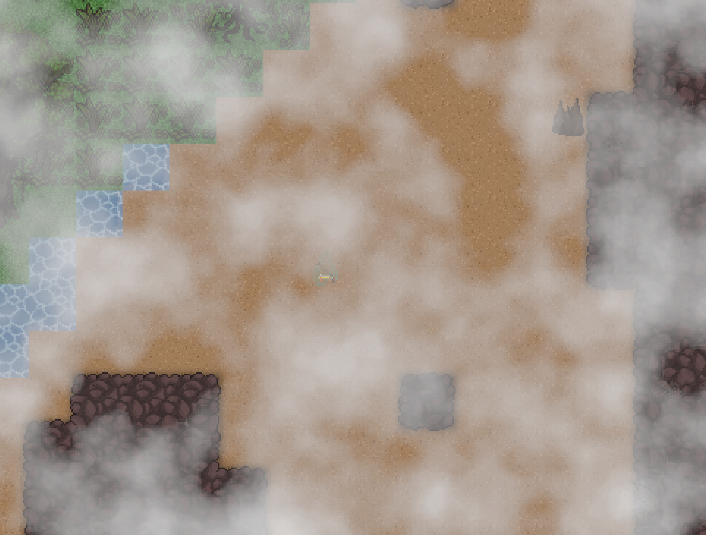
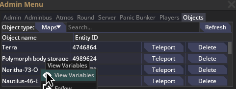
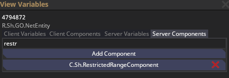

# Building Stuff

## Placing entities/tiles in a rectangular shape

- To easily place many tiles or entities at the same time, select what you want to place and **hold CTRL** while clicking on the first corner. Then **release CTRL** and move your mouse to select the second corner. Click the second corner without holding CTRL.
  - This only works when placing tiles/entities aligned to the grid. If you want to place a bunch of entities that are normally placed freely, select SnapgridCenter or SnapgridBorder in the dropdown menu of the spawn panel.

    

## Removing the clouds from a planet map
When loading into a planet map, it'll be covered by clouds like this:  
  

1. Open F7's Objects tab and select Maps in the dropdown, then open VV on your map
  
2. Find and delete the RestrictedRangeComponent
  
